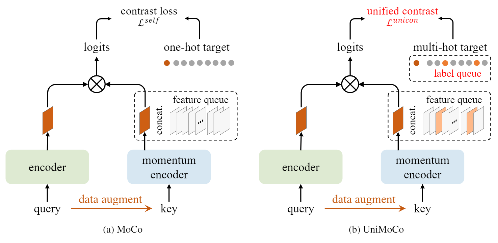

## UniMoCo: Unsupervised, Semi-Supervised and Full-Supervised Visual Representation Learning
This is the official PyTorch implementation for [UniMoCo paper](https://arxiv.org/abs/2103.10773): 
```
@article{dai2021unimoco,
  author  = {Zhigang Dai and Bolun Cai and Yugeng Lin and Junying Chen},
  title   = {UniMoCo: Unsupervised, Semi-Supervised and Full-Supervised Visual Representation Learning},
  journal = {arXiv preprint arXiv:2103.10773},
  year    = {2021},
}
```
In UniMoCo, we generalize MoCo to a unified contrastive learning framework, which supports unsupervised, semi-supervised and full-supervised visual representation learning. Based on MoCo, we maintain a label queue to store supervised labels. With the label queue, we can construct the multi-hot target on-the-fly, which represents postives and negatives of the given query. Besides, we propose a unified contrastive loss to deal with arbitrary number of positives and negatives. There is a comparison between MoCo and UniMoCo.


<p align="center">
  
</p>


## ImageNet Pre-training
### Data Preparation

Install PyTorch and ImageNet dataset following the [official PyTorch ImageNet training code](https://github.com/pytorch/examples/tree/master/imagenet).


### Pre-training

To perform supervised contrastive learning of ResNet-50 model on ImageNet with 8 gpus for 800 epochs, run:
```
python main_unimoco.py \
  -a resnet50 \
  --lr 0.03 \
  --batch-size 256 \
  --epochs 800 \
  --dist-url 'tcp://localhost:10001' \
  --multiprocessing-distributed --world-size 1 --rank 0 \
  --mlp \
  --moco-t 0.2 \
  --aug-plus \
  --cos \
  [your imagenet-folder with train and val folders]
```
By default, the script performs full-supervised contrasitve learning.

Set `--supervised-list` to perform semi-supervised contrastive learning with different label ratios. For exmaple, 60% labels: `--supervised-list ./label_info/60percent.txt`. 

This script uses all the default hyper-parameters as described in the [MoCo v2](https://github.com/facebookresearch/moco).


### Results


Linear classification and COCO detection 1x schedule (R50-C4) fine-tuning results:
<table><tbody>
<th valign="bottom">model</th>
<th valign="bottom">ratios</th>
<th valign="bottom">top-1 acc.</th>
<th valign="bottom">top-5 acc.</th>
<th valign="bottom">AP</th>
<tr><td align="left">UniMoCo</td>
<td align="center">0%</td>
<td align="center">71.1</td>
<td align="center">90.1</td>
<td align="center">39.0</td>
</tr>
<tr><td align="left">UniMoCo</td>
<td align="center">10%</td>
<td align="center">72.0</td>
<td align="center">90.3</td>
<td align="center">39.3</td>
</tr>
<tr><td align="left">UniMoCo</td>
<td align="center">30%</td>
<td align="center">75.1</td>
<td align="center">92.5</td>
<td align="center">39.6</td>
</tr>
<tr><td align="left">UniMoCo</td>
<td align="center">60%</td>
<td align="center">76.2</td>
<td align="center">93.0</td>
<td align="center"><b>39.8</b></td>
</tr>
<tr><td align="left">UniMoCo</td>
<td align="center">100%</td>
<td align="center"><b>76.4</b></td>
<td align="center"><b>93.1</b></td>
<td align="center">39.6</td>
</tr>
</tbody></table>

Check more details about linear classification and detection fine-tuning on [MoCo](https://github.com/facebookresearch/moco).

Models are coming soon.

### License

This project is under the CC-BY-NC 4.0 license. See [LICENSE](LICENSE) for details.
